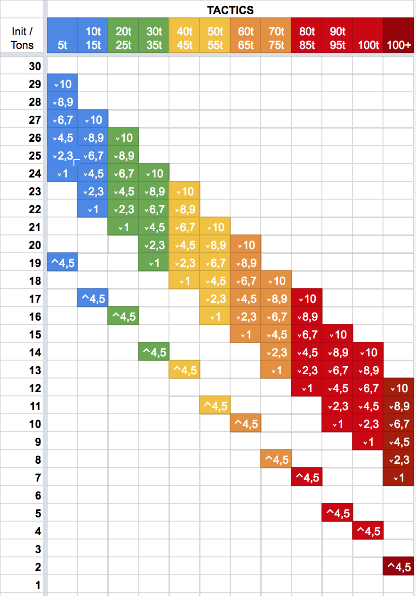
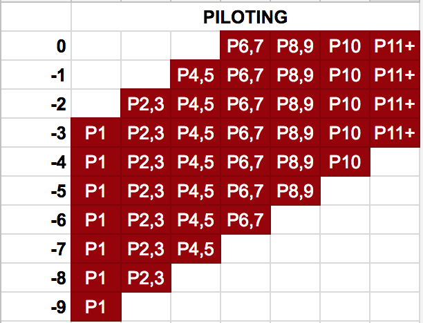

# Skill Based Initiative
This is a mod for the [HBS BattleTech](http://battletechgame.com/) game that divides each round of play into 30 initiatives phases. Each round, every model's place in the initiative order is determined by the pilot's skills, chassis weight, injuries taken, morale state and many other factors. A small random factor is applied to these results. The end result is to make the turn sequence less deterministic and something you have to cope with instead of being able to fully plan out your strategy.

The skill level of each Pilot becomes very important in this mod. Novice MechWarriors with low tactics or piloting skill will typically act later in the round, even in light or medium mechs. Veteran MechWarriors can push the limits of their equipment and have heavy or assault mechs going at the same time as unskilled lights. High-tech equipment such *Clan cockpits* provide initiative bonuses that can boost the weak or help the elite become even more fearsome.

Instead of four weight classes (light / medium / heavy / assault), this mod divides units into 10-ton groups. 20-25 ton mechs are slightly faster than 30-35 ton mechs. 40-45 ton mechs are faster than 50-55 ton mechs, while 60-65 ton mechs are faster than 70-75 ton mechs. 80-85 tons mechs are faster than 90-95, which are faster than 100. This offers a small bonus to pilots of lighter units.

Almost all values are available through tooltips in the mech bay, lance drop and combat UI screens. Hover over the initiative badges (the hexagons) and many details of the system will be defined.

This mod requires [https://github.com/iceraptor/IRBTModUtils/]. Grab the latest release of __IRBTModUtils__ and extract it in your Mods/ directory alongside of this mod.

This mod uses assets from [https://game-icons.net/], which are licensed through a CC BY 3.0 license. I've modified these icons by making them transparent, or changing the color of the icon, but otherwise they are unmodified. 

## Skills

This mod emphasizes a MechWarrior's Tactics, Guts, and Piloting skills.

* Tactics contributes directly to the initiative value. If you want your Mechwarriors to consistently achieve a high phase number, increase their Tactics skill.
* Guts prevents initiative losses from injuries or melee attacks. A high guts rating is necessary to ensure you retain high phase numbers even after taking damage.
* Piloting prevents initiative losses from knockdowns, shutdowns, and other effects. A high piloting rating is necessary to ensure you don't get dropped too far back in the phase order due to knockdowns.

## Pilot Tags

Certain pilot tags provide bonuses or penalties to reflect the different quirks each pilot has.

## Effects

Certain effects impact your phase number during the course of battle. These effects include:

* **Injuries** - Pilots with injuries suffer an initiative penalty when the receive the injury, and a smaller penalty on subsequent rounds. This effect is reduced by high Guts skill. **Ouch!** modifiers are from injuries.
* **Knockdown** - BattleMechs that are knocked down suffer an initiative penalty on the round they are knocked down, or on the following round if they have already activated. This effect is reduced by high Piloting skill. **Thud!** modifiers are from knockdown.
* **Crippled Movement** - BattleMechs with a missing leg and vehicles with a missing side count as *crippled* and suffer an initiative penalty. This penalty is reduced by high Piloting skill. **Crippled!** modifiers are from crippled movement.
* **Equipment** - Any chassis or component that modifies the *BaseInititiative* statistic of the unit is honored. In RogueTech, most cockpits provide a small initiative bonus.
* **Inspired** - Pilots that are inspired by high Morale (or Fury) randomly gain between +1 and +3 when a new round begins. **Inspired!** modifiers are from morale or fury.
* **Spirit** - Pilots *High Spirits* tag gain a +2 initiative bonus. Pilots with the *Low Spirits* tag suffer a -2 initiative penalty.
* **Reserve** Units that reserve drop between 2 to 7 phases. This drop is carried over to the next round as penalty, reflecting the hesitation of the unit. **Hesitation!** modifiers are this carry-over penalty.

## Usage

This mod is only intended to be used with RogueTech. You may freely us it standalone, but this mod expects TurnDirector.IsInterleaved to always be true. This is achieved by the **AlwaysCombatTurns** mod, which this mod depends upon. It also requires the components from **CustomComponents** and **MechEngineer**, both of which are also dependencies.

If you are using this mod independently of RougeTech, you'll likely want to add initiative boosting equipment or skills of some kind.

### Dependencies
  
This mod depends on several other mods to function

### Disabling The Mod
To disable the mod, edit `SkillBasedInitiative/mod.json` and change `enabled:true` to `enabled:false`. This will prevent the mod from loading, restoring the original HBS experience. However, it will also **break your RogueTech experience** due to the various pieces of equipment that add initiative modifiers. The net effect is that most units will act in phase 1, rendering initiative largely useless. You will need to do significant overhauls on all the equipment in the mod to remove any **BaseInitiative** changes.

### Changing Colors
The mod applies colors to the following combat UI elements:

* Initiative Hexagon above the Mech Paper doll
* Initiative Hexagon floating above the Mech
* Pilot Name background bar

These colors can be customized through the `mod.json`.

## Planned

Works in progress or planned effects include:

- [] BUG: Hesitation not working as expected. Math.min used instead of Math.max
- [] Units that are unsettled, panicked or similar will have a reduced initiative.
- [x] Reduce penalties for injuries at the bottom end of the guts range
- [x] Change start-of-phase popups to be buff/debuff icons shown when a friendly mech is selected
- [x] Change combat tooltip to show both static and dynamic effects
- [x] Change combat tooltip to no longer obscure the paperdoll
- [] Show an initiative track at the top of the screen so that players know which models are going when. Perhaps use the unit icons and a number underneath them?
- [] Modify Reserve button to change to 'Reserve to Phase 1' when ALT key is held down. Model pays for all the phases it holds though. (See BTDebug for how to lash to ALT key)
- [] Tooltips for ability boosted state
- [] Tooltips for melee bonus to attack, resist
- [] Change text for Called Shot, Vigiliance to reflect the new functions under SBI
- [] Check all modifiers to ensure they can be reduced to 0 with high enough stats

### Bugs and Issues

These items are known bugs or issues that should be resolved before declaring a 1.0 version.

* **CONFIRMED BUG**: When loading a save that is within a battle, the phase bars are displayed.
* Determine if there are other stats that should be evaluated. In particular "PhaseModifier" : "PhaseModifierSelf" may be appropriate to check on each round.
* Extract logging from HBS.Logging to prevent duplication of logs
* Knockdown doesn't seem to immediately apply in some cases - see https://www.twitch.tv/videos/345435095 @ 1:31
* Crippled on vehicles is a very narrow margin. Once their structure is removed, they are destroyed - so this rarely happens. This would be better served with a critical hit effect, like broken tracks?
* *CONSIDER*: Should knockdown penalty apply on the turn you go down? You're already taking an injury penalty there. YES, because you can have bonusHealth that will avoid the injury penalty.

## Technical Details

The sections below detail some of the calculations used by the mod. Please note that these can vary as the code changes, and may be out of date. You are better off checking the code for these details instead of relying upon this documentation.

### Impact of Tactics Skill
A MechWarriors's **Tactics** skill adds a flat modifier to the base initiative defined by the unit tonnage. This value is graduated, as defined in the table below.

Skill |  1  |  2  |  3  |  4  |  5  |  6  |  7  |  8  |  9  |  10  | 11 | 12 | 13 
-- | -- | -- | -- | -- | -- | -- | -- | -- | -- | -- | -- | -- | -- 
Modifier                  | +0 | +1 | +1 | +2 | +2 | +3 | +3 | +4 | +4 | +5 | +6 | +7 | +8
with Level 5 Ability | +0 | +1 | +1 | +2 | +3 | +4 | +4 | +5 | +5 | +6 | +7 | +8 | +9
with Level 8 Ability | +0 | +1 | +1 | +2 | +4 | +5 | +5 | +6 | +6 | +7 | +8 | +9 | +10

The following diagram illustrates the combination of tonnage and tactics to show the various ranges in which units will operate. In the table below, the sum is given by the ⌄ symbol, next to the tactics value that would set the boundary. The ⌃4,5 block defines the **minimum** value for a pilot with Piloting skill 4 or 5. As we'll see shortly, this value can be used to evaluate how average skill units will interact across tactics and tonnage limits.

#### Reserve Penalty
In addition, tactics reduces the impact of the reserve carry over penalty. Each time a unit reserves, the number of phases dropped is added to a penalty applied on the following round. Each time the phase drop is applied, it is reduced by the tactics skill modifier defined above. A high enough tactics modifier can reduce this penalty to 0.

Example: A unit reserves 3 times during a round, dropping 5 phases, 3 phases, and 7 phases. The reserve penalty applied on the following round would be:

Tactics | Modifier | Calculation | Penalty
-- | -- | -- | --
3 | +1 | (-5 + 1 = -4) + (-3 + 1 = -2) + (-7 + 1 = -6) | -12
5 | +2 | (-5 + 2 = -3) + (-3 + 2 = -1) + (-7 + 2 = -5) | -9
7 | +3 | (-5 + 3 = -2) + (-3 + 3 = 0) + (-7 + 3 = -4) | -6 
9 | +4 | (-5 + 4 = -1) + (-3 + 4 = 0) + (-7 + 4 = -3) | -4 

### Impact of Piloting

The Piloting skill impacts initiative in two ways. The first is by reducing a random element that is added each turn. Each turn, a unit's maximum initiative (tonnage initiative + tactics modifier + equipment modifiers) is reduced by a random amount, defined in the table below:

Skill | 1 | 2 | 3 | 4 | 5 | 6 | 7 | 8 | 9 | 10 | 11 | 12 | 13 
-- | -- | -- | -- | -- | -- | -- | -- | -- | -- | -- | -- | -- | -- 
Random Modifier | 3-9 | 2-8 | 2-8 | 1-7 | 1-7 | 0-6 | 0-6 | 0-5 | 0-5 | 0-4 | 0-3 | 0-3 | 0-2

The diagram below illustrates this as ranges based around the maximum initiative, represented as 0.

In addition, some effects that reduce your initiative will be offset by a high piloting skill. Suffering a knockdown, being prone or shutdown results in initiative penalties. These penalties are reduced as per the table below:

| Skill                | 1    | 2    | 3    | 4    | 5    | 6    | 7    | 8    | 9    | 10   | 11   | 12   | 13   |
| -------------------- | ---- | ---- | ---- | ---- | ---- | ---- | ---- | ---- | ---- | ---- | ---- | ---- | ---- |
| Modifier             | +0   | +1   | +1   | +2   | +2   | +3   | +3   | +4   | +4   | +5   | +6   | +7   | +8   |
| with Level 5 Ability | +0   | +1   | +1   | +2   | +3   | +4   | +4   | +5   | +5   | +6   | +7   | +8   | +9   |
| with Level 8 Ability | +0   | +1   | +1   | +2   | +4   | +5   | +5   | +6   | +6   | +7   | +8   | +9   | +10  |

If the modifier is greater than the penalty, a flat -1 penalty will be applied.

### Impact of Guts

Guts skill comes into play when the pilot suffers an injury, or the unit is successfully attacked in melee.

When a pilot is injured, they suffer a random penalty within a range bounded by their Guts skill. The ranges are defined below.

Skill | 1 | 2 | 3 | 4 | 5 | 6 | 7 | 8 | 9 | 10 | 11 | 12 | 13
-- | -- | -- | -- | -- | -- | -- | -- | -- | -- | -- | -- | -- | --
Injury Modifier | 5-7 | 4-6 | 4-6 | 3-6 | 3-6 | 3-5 | 3-5 | 2-5 | 2-5 | 1-4 | 1-3 | 1-3 | 1-2

Each injury adds +1 to the upper bound only. A pilot with Guts 5 and 2 injuries would suffer between -4 and -9 when they are injured, both on the turn they are injured and on subsequent turns. However, on subsequent turns this penalty is halved, representing the pilot fighting through the pain.

When successfully damaged by a melee attack, the unit suffers an initiative penalty determined by the relative tonnage of the attacker and defender (see above). This penalty is reduced by the target's Guts skill rating, as defined by the table below.

| Skill                | 1    | 2    | 3    | 4    | 5    | 6    | 7    | 8    | 9    | 10   | 11   | 12   | 13   |
| -------------------- | ---- | ---- | ---- | ---- | ---- | ---- | ---- | ---- | ---- | ---- | ---- | ---- | ---- |
| Modifier             | +0   | +1   | +1   | +2   | +2   | +3   | +3   | +4   | +4   | +5   | +6   | +7   | +8   |
| with Level 5 Ability | +0   | +1   | +1   | +2   | +3   | +4   | +4   | +5   | +5   | +6   | +7   | +8   | +9   |
| with Level 8 Ability | +0   | +1   | +1   | +2   | +4   | +5   | +5   | +6   | +6   | +7   | +8   | +9   | +10  |

If the modifier is greater than the penalty, a flat -1 penalty will be applied.

### Pilot Tags

Pilot tags impact the game in three major ways:
​    1) some provide a direct bonus or penalty to initiative
​    2) some provide a bonus or penalty to the tonnage calculation for melee purposes
​    3) a rare few provide subtle, unique benefits

#### Direct Modifiers

In the `mod.json` file the property `PilotTagModifiers` defines a dictionary keyed by `pilot tag` with a value equal to the direct initiative modifier applied to that tag. These values must be integers, those positive and negative values are allowed. Currently the only tags with modifiers are:

* **pilot_morale_high** : +2
* **pilot_morale_low**: -2

#### Melee Modifiers

In the `mod.json` file the property `PilotTagMeleeMultipliers` defines a dictionary keyed by `pilot tag` with a value of an array with two values. The first value defines a bonus or penalty to the melee tonnage multiplier as a percentage. The second value defines the bonus or penalty used when defending. These values are floats, and are added to a base of 1.0. For an array value of `[ 0.25, 0.50 ]` the model would multiply it's tonnage by 1.25 when determining the melee attack modifier, and 0.50 when defending against a melee attack. A 50 ton mech would count as 62.5 tons (rounded down), for attacking, and 75 tons for defending. Currently the tags with these modifiers are:

* **pilot_drunk** : 0.0, 0.5
* **pilot_gladiator** : 0.25, 0.25
* **pilot_assassin** : 0.5, 0.0

#### Special bonuses

Some tags will provide unique bonuses that aren't easily modifable. The tweaks are:

* **pilot_reckless** (PLANNED) - the unit cannot reserve

### Tonnage Impact
The tonnage of a unit determines a multiplier applied to the lower (3) and upper (5) bounds of the phase calculation. After multiplication, the lower bound is rounded down, while the upper bound is rounded up.

Tonnage | 05 | 10-15 | 20-25 | 30-35 | 40-45 | 50-55 | 60-65 | 70-75 | 80-85 | 90-95 | 100 | 100+
-- | -- | -- | -- | -- | -- | -- | -- | -- | -- | -- | -- | --
*Base Initiative* | 22 | 21 | 20 | 19 | 18 | 17 | 16 | 15 | 14 | 13 | 12 | 9

### Engine Impact
This mod breaks units down into 10-ton ranges, such as 20-25 tons, 30-35 tons, etc. Within each range, there is a sweet-spot for engine ratings where a unit is considered to have a typical engine for its class. Units with engine ratings less than this midpoint suffer an initiative penalty from -6 to -2, while units with engine ratings above this midpoint gain a bonus between +2 to +6.

For a given midpoint, the modifier bounds are defined below.

Modifier | -6 | -4 | -2 | +0 | +2 | +4 | +6
-- | -- | -- | -- | -- | -- | -- | --
Midpoint Multiplier | 0.3 | 0.6 | 0.8 | 1.0 | 1.2 | 1.4 | 1.7
Example | 2	| 4 | 6	| 8	| 10 | 12	| 14

Each unit's engine rating is divided by its tonnage to define an **engine ratio**. Ratios above the midpoint are are rounded up to the nearest integer, while ratios below the midpoint are rounded down. These are then compared against the bounds to determine the modifier that will be applied.

The breakpoints by tonnage and rating are defined below:

Tons / Mod | -6 | -4 | -2 | +0 | +2 | +4 | +6
-- | -- | -- | -- | -- | -- | -- | --
5 | 15| 30 | 40 | 55 | 70 | 80 | 95
10 | 30 | 60 | 80 | 100 | 120 | 140 | 170
15 | 30 | 75 | 105 | 135 | 165 | 195 | 240
20 | 40 | 80 | 120 | 160 | 200 | 240 | 280
25 | 50 | 100 | 150 | 200 | 250 | 300 | 350
30 | 60 | 120 | 150 | 210 | 270 | 300 | 360
35 | 70 | 140 | 175 | 245 | 315 | 350 | 420
40 | 40 | 120 | 160 | 240 | 320 | 360 | NA
45 | 45 | 135 | 180 | 270 | 360 | 405 | NA
50 | 50 | 150 | 200 | 250 | 300 | 350 | NA
55 | 55 | 165 | 220 | 275 | 330 | 385 | NA
60 | 60 | 120 | 180 | 240 | 300 | 360 | NA
65 | 65 | 130 | 195 | 260 | 325 | 390 | NA
70 | 70 | 140 | 210 | 280 | 350 | 420 | NA
75 | 75 | 150 | 225 | 300 | 375 | 450 | NA
80 | NA | 80 | 160 | 240 | 320 | 400 | NA
85 | NA | 85 | 170 | 255 | 340 | 425 | NA
90 | NA | 90 | 180 | 270 | 360 | NA | NA
95 | NA | 95 | 190 | 285 | 380 | NA | NA
100 | NA | 100 | 200 | 300 | 400 | NA | NA
150 | NA | 150 | 150 | 300 | NA | NA | NA
200 | NA | 200 | 200 | 400 | NA | NA | NA

Units with the `unit_powerarmor` tag have neither a bonus nor penalty.

This feature depends on the [MechEngineer](https://github.com/BattletechModders/MechEngineer/) mod, which depends on [CustomComponents](http://github.com/denadan/CustomComponents/). As such both mods are required for this check.

### Miscellaneous

Turrets suffer a -4 penalty, while tanks suffer a -2 to reflect their relative slowness in the background material. This may be removed in the future if chassis specific quirks are added to replicate this effect.

## Changelog

### 0.5.1
- Fixes issue where static bonuses/penalties were applied twice
- Fixes display issue where tooltips wouldn't show pilot tag bonuses/penalties

### 0.5.0
- Adds tooltips for MechLab, Lance Drop, and Combat screens. Hover over the Initiative badge (hexagon) to see the modifiers being applied.
- Tweaked engine modifiers to be 2/4/6 (instead of 1/2/3)
- Fixed issue with combat saves - can not save during combat and reload.
- Added pilot tags as initiative modifiers. Pilot tags can now result in straight +/- modifers to init. Controlled through mod.json
- Added pilot tag melee multipliers. Pilot tags can now add or subtract to the melee multiplier. Values are added/subtracted from 1.0. The final multiplier is used to determine the effective tonnage of the unit for melee attacks. The first value increase the tonnage as the attacker, the second as the defender.

### 0.4.0
- Adds carry-over penalty for reserve (HESITATION!)
- Adds engine vs. tonnage modifier of -3 to +3
- Removes the green highlight for the profile; now highlights only the name title bar
- Highlight/icon colors exposed through `mod.json`

### 0.3.1
- Eliminates messages from dead actors
- Fixes issue where knockdown, prone, shutdown penalties were applied as bonuses

### 0.3.0
- Possible fix for issue with reinforcements that spawn during a round
- Simplified modifiers, documented as per github.com
- Implemented injury penalties as they occur.
- Bonus health from cockpits works to eliminate injuries
- Reduced existing injury penalties by 1/2.
- Fixes to melee impacts. Guts reduces impacts of melee.
- Refine prone and shutdown modifiers. Prone now incurs a -9, shutdown -6. Both are modified by piloting.
- New approach that allows piloting skill to reduce randomness
- Added some colorization to make it easier to distinguish units that have/haven't activated
