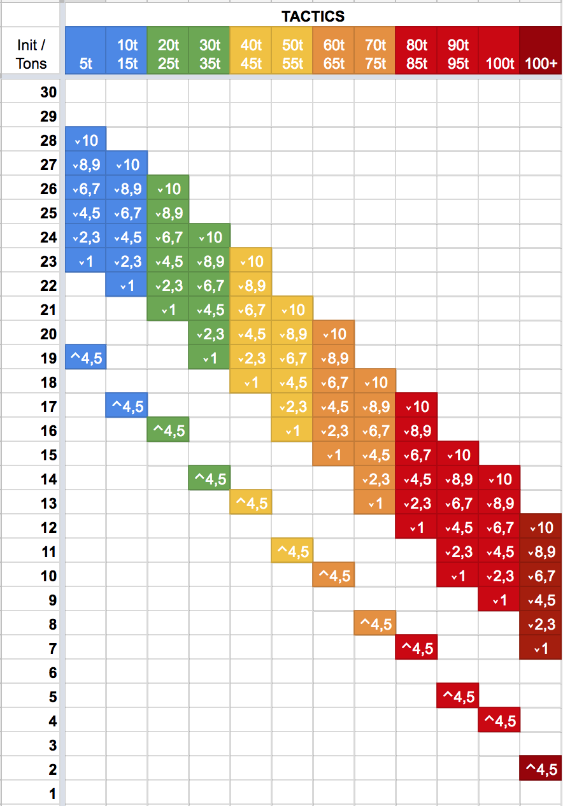

# Skill Based Initiative
This is a mod for the [HBS BattleTech](http://battletechgame.com/) game that divides each round of play into 30 initiatives phases. Each round, every model's place in the initiative order is determined by the pilot's skills, chassis weight, injuries taken, morale state and many other factors. A small random factor is applied to these results. The end result is to make the turn sequence less deterministic and something you have to cope with instead of being able to fully plan out your strategy.

The skill level of each Pilot becomes very important in this mod. Novice MechWarriors with low tactics or piloting skill will typically act later in the round, even in light or medium mechs. Veteran MechWarriors can push the limits of their equipment and have heavy or assault mechs going at the same time as unskilled lights. High-tech equipment such *Clan cockpits* provide initiative bonuses that can boost the weak or help the elite become even more fearsome.

Instead of four weight classes (light / medium / heavy / assault), this mod divides units into 10-ton groups. 20-25 ton mechs are slightly faster than 30-35 ton mechs. 40-45 ton mechs are faster than 50-55 ton mechs, while 60-65 ton mechs are faster than 70-75 ton mechs. 80-85 tons mechs are faster than 90-95, which are faster than 100. This offers a small bonus to pilots of lighter units.

## Usage

This mod is only intended to be used with RogueTech. You may freely us it standalone, but this mod expects TurnDirector.IsInterleaved to always be true. There is another mod to force this interaction;
In addition you will likely want initiative boosting equipment of some kind.

To disable the mod, edit SkillBasedInitiative/mod.json and change enabled:true to enabled:false. This will prevent the mod from loading, but will significantly break your RogueTech experience. You will need to do significant overhauls on any equipment that grants a BaseInitiative modifier to complete the removal of this mod.

## Skills

This mod emphasizes a MechWarrior's Tactics, Guts, and Piloting skills.

* Tactics contributes directly to the initiative value. If you want your Mechwarriors to consistently achieve a high phase number, increase their Tactics skill.
* Guts prevents initiative losses from injuries or melee attacks. A high guts rating is necessary to ensure you retain high phase numbers even after taking damage.
* Piloting prevents initiative losses from knockdowns, shutdowns, and other effects. A high piloting rating is necessary to ensure you don't get dropped too far back in the phase order due to knockdowns.

## Effects

Certain effects impact your phase number during the course of battle. These effects include:

* **Injuries** - Pilots with injuries suffer an initiative penalty when the receive the injury, and a smaller penalty on subsequent rounds. This effect is reduced by high Guts skill. **Ouch!** modifiers are from injuries.
* **Knockdown** - BattleMechs that are knocked down suffer an initiative penalty on the round they are knocked down, or on the following round if they have already activated. This effect is reduced by high Piloting skill. **Thud!** modifiers are from knockdown.
* **Crippled Movement** - BattleMechs with a missing leg and vehicles with a missing side count as *crippled* and suffer an initiative penalty. This penalty is reduced by high Piloting skill. **Crippled!** modifiers are from crippled movement.
* **Equipment** - Any chassis or component that modifies the *BaseInititiative* statistic of the unit is honored. In RogueTech, most cockpits provide a small initiative bonus.
* **Inspired** - Pilots that are inspired by high Morale (or Fury) randomly gain between +1 and +3 when a new round begins. **Inspired!** modifiers are from morale or fury.
* **Spirit** - Pilots *High Spirits* tag gain a +2 initiative bonus. Pilots with the *Low Spirits* tag suffer a -2 initiative penalty.
* **Melee Impact** - Units that are successfully attacked in melee suffer a small initiative penalty on the current round, or the subsequent round if they have already activated. This penalty is increased when the attacker weighs more than the target, and attackers with the *Juggernaught* skill increase this effect further. This penalty is applied *on every successful attack* so light units that are repeatedly attacked may find themselves acting at the very end of the following round! **Clang!** modifiers are from melee impacts.
* **Reserve** Units that reserve lose a random amount of initiative, between 2 and 7 phases.

## Planned

Works in progress or planned effects include:

* *Planned*: Units will gain a small boost to their total initiative rating based upon their engine core. Rating / Tonnage / 10 = % boost.
* *Planned*: Units that reserve will gain a small init penalty in the coming round. The more reserves that occur, the greater the penalty will be in the following round. A high tactics skill will mitigate this effect.
* *Planned*: Knockdowns will note 'Going Down!' as their init bubble.
* *Planned*: Units that are unsettled, panicked or similar will have a reduced initiative.
* *Planned*: Show an initiative track at the top of the screen so that players know which models are going when. Perhaps use the unit icons and a number underneath them?
* *Planned*: In the MechBay and Lance Drop screens, show the BaseInitiative modifier for mechs when there is no pilot selected. When only a pilot is selected, show their Tactics+Piloting rating. When both are selected, show the expected range.

### Bugs and Incomplete functions

These items are known bugs or issues that should be resolved before declaring a 1.0 version.

* **CONFIRMED BUG**: When loading a save that is within a battle, the phase bars are displayed.
* **CONFIRMED BUG**: When reserves spawn, they don't necessarily get OnRoundBeing invoked. This causes NPEs in the lookup of ActorInit. Protect the ActorInit fetch.
* Determine if there are other stats that should be evaluated. In particular "PhaseModifier" : "PhaseModifierSelf" may be appropriate to check on each round.
* Extract logging from HBS.Logging to prevent duplication of logs
* Init can wrap below 0 when it's dynamically applied. This can prevent a unit from activating at all.
* Percentages have too many significant digits (looks ugly in logs)
* Bonus health from cockpits isn't handled; injury penalties should ignore up to (bonus health) hits before applying the penalty
* Knockdown doesn't seem to immediately apply in some cases - see https://www.twitch.tv/videos/345435095 @ 1:31
* Crippled on vehicles is a very narrow margin. Once their structure is removed, they are destroyed - so this rarely happens. This would be better served with a critical hit effect, like broken tracks?

## Technical Details

The sections below detail some of the calculations used by the mod. Please note that these can vary as the code changes, and may be out of date. You are better off checking the code for these details instead of relying upon this documentation.

### Tonnage Impact
The tonnage of a unit determines a multiplier applied to the lower (3) and upper (5) bounds of the phase calculation. After multiplication, the lower bound is rounded down, while the upper bound is rounded up.

Tonnage | Base Initiative
--------|----------
05      | 
10-15   |
20-25   |
30-35   |
40-45   |
50-55   |
60-65   |
70-75   |
80-85   |
90-95   |
100     |
100+    |

### Impact of Tactics Skill
A MechWarriors's Tactics

`Math.Floor((pilot.Tactics * 2.0 + pilot.Piloting) / 3.0) / 10.0;`

Some examples illustrate the interplay between Tactics and Piloting:

* A mechwarrior with Tactics 1 and Piloting 1 increase the tonnage modifier by `((2 + 1) / 3) / 10.0 = 0.1`. In a 50 ton mech, their phase bounds would be `x2.3 + 0.1 = x2.4`.
* A mechwarrior with Tactics 6 and Piloting 3 increase the tonnage modifier by `((12 + 3) / 3) / 10.0 = 0.5`. In a 50 ton mech, their phase bounds would be `x2.3 + 0.5 = x2.8`.
* A mechwarrior with Tactics 10 and Piloting 1 increase the tonnage modifier by `((20 + 2) / 3) / 10.0 = 0.7`. In a 50 ton mech, their phase bounds would be `x2.3 + 1.0 = x3.3`.
* A mechwarrior with Tactics 1 and Piloting 10 increase the tonnage modifier by `((2 + 10) / 3) / 10.0 = 0.4`. In a 50 ton mech, their phase bounds would be `x2.3 + 0.4 = x2.7`.

### Impact of Piloting

Many battlefield conditions reduce your initiative. Your piloting skill reduces the impact of these effects by 5% for each point of the skill. A mechwarrior with piloting 5 would reduce any effect by 25%, to a minimum of -1. This reduction is applied to knockdown, when your movement is crippled, or when the mech is shutdown or prone.

### Impact of Guts

When a battlefield condition would stun or injure a mechwarrior, the size of the penalty is determined by the Mechwarrior's Guts skill rating. The following list defines the penalty range in terms of the skill level:

Guts Rating | Initiative Range
------------|---------------
1 |  -6 to -9
2, 3, 4 |  -5 to -8
5, 6, |  -4 to -7
7, 8 |  -4 to -7
9 |  -2 to -5
10 |  -1 to -4

Each injury adds -1 to the upper bound only. A mechwarrior with Guts 5 and 2 injuries would randomly suffer between -4 and -9 when they are injured, and on all subsequent turns.

Mechwarriors lose initiative anytime they are injured.

Your guts skill reduces the impact of melee impacts by 5% for each point of the skill. A mechwarrior with guts 5 would reduce any effect by 25%, to a minimum of -1.

### Miscellaneous

Turrets suffer a -4 penalty, while tanks suffer a -2. These will likely be removed in the future once it's been confirmed that init bonuses on chassis and components will flow through the system.
