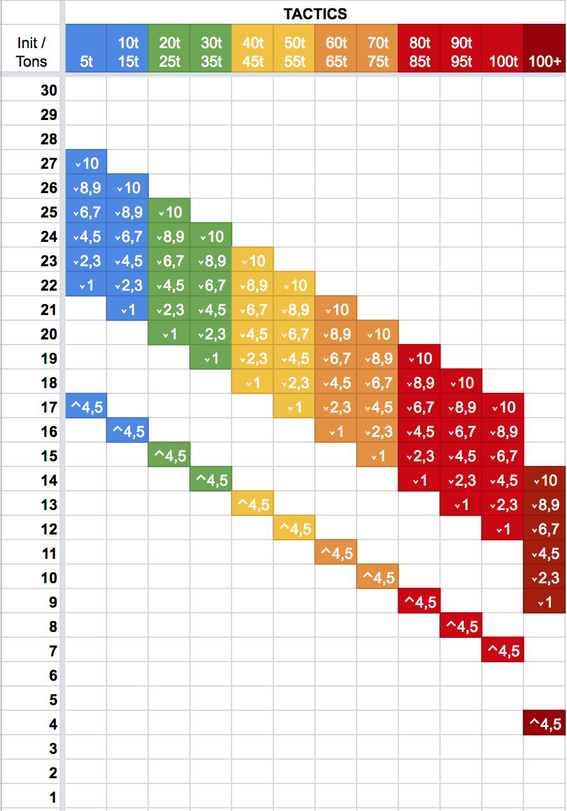

# Skill Based Initiative
This is a mod for the [HBS BattleTech](http://battletechgame.com/) game that divides each round of play into 30 initiatives phases. Each round, every model's place in the initiative order is determined by the pilot's skills, chassis weight, injuries taken, morale state and many other factors. A small random factor is applied to these results. The end result is to make the turn sequence less deterministic and something you have to cope with instead of being able to fully plan out your strategy.

This mod uses assets from [https://game-icons.net/], which are licensed through a CC BY 3.0 license. I've modified these icons by making them transparent, or changing the color of the icon, but otherwise they are unmodified. 

## Summary

The skill level of each Pilot becomes very important in this mod. Novice MechWarriors with low tactics or piloting skill will typically act later in the round, even in light or medium mechs. Veteran MechWarriors can push the limits of their equipment and have heavy or assault mechs going at the same time as unskilled lights. High-tech equipment such *Clan cockpits* provide initiative bonuses that can boost the weak or help the elite become even more fearsome.

Instead of four weight classes (light / medium / heavy / assault), this mod divides units into 10-ton groups. 20-25 ton mechs are slightly faster than 30-35 ton mechs. 40-45 ton mechs are faster than 50-55 ton mechs, while 60-65 ton mechs are faster than 70-75 ton mechs. 80-85 tons mechs are faster than 90-95, which are faster than 100. This offers a small bonus to pilots of lighter units.

Almost all values are available through tooltips in the mech bay, lance drop and combat UI screens. Hover over the initiative badges (the hexagons) and many details of the system will be defined.

### Dependencies

This mod requires the following mods to function properly:
  
  * [https://github.com/battletechmodders/IRBTModUtils/]
  * [https://github.com/BattletechModders/CustomComponents/]
  * [https://github.com/BattletechModders/CustomBundle/tree/master/CustomUnits]

You are strongly encouraged to use [Tis But a Scratch (TBAS) with this](https://github.com/ajkroeg/TisButAScratch) to inflict initiative based injury modifiers.

### Usage

This mod is only intended to be used with RogueTech. You may freely us it standalone, but this mod expects TurnDirector.IsInterleaved to always be true. This is achieved by the **AlwaysCombatTurns** mod, which this mod depends upon. It also requires the components from **CustomComponents** and **MechEngineer**, both of which are also dependencies.

If you are using this mod independently of RougeTech, you'll likely want to add initiative boosting equipment or skills of some kind.

### Disabling The Mod
To disable the mod, edit `SkillBasedInitiative/mod.json` and change `enabled:true` to `enabled:false`. This will prevent the mod from loading, restoring the original HBS experience. However, it will also **break your RogueTech experience** due to the various pieces of equipment that add initiative modifiers. The net effect is that most units will act in phase 1, rendering initiative largely useless. You will need to do significant overhauls on all the equipment in the mod to remove any **BaseInitiative** changes.

## Technical Details

At the start of each actor's turn (`AbstractActor.OnNewRound`) the mod calculates a new initiative value using the following calculation:

`round_init = tonnage_mod + unit_type_mod + sum(pilot_tag_mods) + injury_mod + misc_mod + called_shot_state + vigilance_state + knockdown_mod + crippled_mod + shutdown_mod + hesitation_mod + inspired_mod + randomness_mod`

Each of these modifiers are described in further detail below. Note that some values are referred to as *mod*ifiers and some are *state*. Modifiers are statistics that you can freely adjust with status effects, without interfering with the internals of SBI. State variables are also statistics, but will be consumed (reset to 0) when the actor's initiative is calculated at the start of the turn. Because of this property you should *NOT* apply status effects to them. When status effects are removed (due to damage or expiration) they reverse their changes. This can lead to very odd situations where SBI changed a value from 2 to 0, which then becomes -2 because the status effect was removed. You've been warned.

### List of Statistics 

| Statistic | Type | Source | Description | Default Value |
| -- | -- | -- | -- | -- | 
| SBI_MOD_INJURY | Integer | Actor | Direct modifier to initiative from injuries. Intended to be used for TBAS integration. | 0 |
| SBI_MOD_MISC | Integer | Actor | Direct modifier to initiative for miscellaneous effects. | 0 |
| SBI_MOD_CALLED_SHOT_ATTACKER | Actor | Integer | Modifies the calculation of the called shot penalty (see below). Read from the attacking actor. | 0 |
| SBI_MOD_CALLED_SHOT_TARGET | Actor | Integer | Modifies the *generated* called shot penalty (see below). Read from the defending actor. | 0 |
| SBI_MOD_VIGILANCE | Actor | Integer | Modifies the *generated* vigilance bonus that will be applied to SBI_STATE_VIGILANCE. | 0 |
| SBI_MOD_HESITATION | Actor | Integer | A modifier to the *generated* hesitation, that will be added to the SBI_STATE_HESITATION statistic. Does NOT | 0 |
| SBI_MOD_SKILL_GUNNERY | Actor | Integer | Indirect modifier that alters the calculated modifier from the gunnery skill (see below) | 0 |
| SBI_MOD_SKILL_GUTS | Actor | Integer | Indirect modifier that alters the calculated modifier from the guts skill (see below) | 0 |
| SBI_MOD_SKILL_PILOT | Actor | Integer | Indirect modifier that alters the calculated modifier from the guts skill (see below) | 0 |
| SBI_MOD_SKILL_TACTICS | Actor | Integer | Indirect modifier that alters the calculated modifier from the guts skill (see below) | 0 |
| SBI_STATE_TONNAGE | Actor | Integer | Maps the actor's tonnage to a starting init value. Mapping is defined in mod.json, as InitBaseByTonnage dictionary. Calculated at the start of combat and never changed. | 0 |
| SBI_STATE_UNIT_TYPE | Actor | Integer | Direct modifier to initiative based upon the actor's type - mech, trooper squad, naval, vehicle, etc. Calculated at the start of combat and never changed. | 0 |
| SBI_STATE_PILOT_TAGS | Actor | Integer | Direct modifiers to initiative based on a pilot tag. Mapping defined in mod.json in Pilot.PilotTagModifiers. Calculated at the start of combat and never changed. | 0 |
| SBI_STATE_CALLED_SHOT | Actor | Integer | The current total called shot penalty to apply on the following turn. | 0 |
| SBI_STATE_VIGILANCE | Actor | Integer | The current total vigilance bonus to apply on the following turn. | 0 |
| SBI_STATE_KNOCKDOWN | Actor | Integer | The current total knockdown penalty to apply on the following turn. | 0 |
| SBI_STATE_HESITATION | Actor | Integer | The current total hesitation penalty to apply on the following turn. | 0 |

### Skill Normalization
This mod uses a normalized skill value in many places. Because skill values can range from 1-20 in RougeTech, but initiative phases only go from 30-1, we normalize skill values to smaller modifier values. The table below shows the correspondence between skill value and modifier:

| Skill |  1  |  2  |  3  |  4  |  5  |  6  |  7  |  8  |  9  |  10  | 11 | 12 | 13 |
| -- | -- | -- | -- | -- | -- | -- | -- | -- | -- | -- | -- | -- | --  |
| Modifier  | +0 | +1 | +1 | +2 | +2 | +3 | +3 | +4 | +4 | +5 | +6 | +7 | +8 | 

In addition, SBI offers three statistics that allow mod authors to modify these normalized modifiers. The statistics `SBI_MOD_GUTS`, `SBI_MOD_PILOTING`, and `SBI_MOD_TACTICS` are added to the calculated modifier above for their respective skill calculation.

(!) The skill statistics are read from the PILOT stat collection, NOT the actor stat collection. Make sure your effects target the proper collection!

> Example: A Pilot with tactics of 7 has a SBI_MOD_TACTICS value of 2. Their normalized skill modifier is +3, +2 for the SBI_MOD_TACTICS value, for a total of 5.

### Tonnage Modifier

The `tonnage_mod` is calculated by comparing the unit's tonnage against the relevant UnitConfig.InitBaseByTonnage dictionary. The keys of the dictionary are walked, and if the unit's tonnage is less than the current key the previous key's value is used as the `tonnage_mod`. The calculation of tonnage varies by unit type, as shown below:

* Mech.InitBaseByTonnage - The tonnage in the mechDef is used.
* Trooper.InitBaseByTonnage - As this is a CustomUnits type, tonnage is pulled from the mechDef. This tonnage is divided by the number of troopers configured for the squad.
* Naval.InitBaseByTonnage - As this is a CustomUnits type, tonnage is pulled from the mechDef.
* Vehicle.InitBaseByTonnage - If the unit is a true vehicle, tonnage is pulled from the vehicleDef. If it's a CustomUnits FakeVehicle, tonnage is pulled from the mechDef.
* Turret.InitBaseByTonnage - The unit's tags are scanned for `unit_light`, `unit_medium`, or `unit_heavy`. These are matched against `Turret.LightTonnage`, `Turret.MediumTonnage`, and `Turret.HeavyTonnage` respectively. If one of these tags are not found, Turret.DefaultTonnage is used instead

> Example: For a configuration of Unit.InitBaseByTonnage = { "35" : 16, "75" : 12, "100" : 9, "999" : 6 } units between 0-35 tons would have a base init of 16, units between 36-75 tons would have a base init of 12, and units between 76-100 would have a base init of 9. Units between 101-999 tons would use a base init of 6.

### Unit Type Modifier

The `unit_type_mod` is a direct modifier assigned from the `Unit.TypeMod` value for the relative unit type. The unit type is determined via the following algorithm:

* Turrets are defined as HBS Turret types
* Vehicles are either HBS Vehicle types, or CustomUnit FakeVehicles with isVehicle=true
* Naval units are CustomUnits with Naval=true
* Trooper Squads are CustomUnits with SquadInfo.Troopers > 1
* Everything else is a Mech

### Called Shot Modifier

When a unit is targeted by the Called Shot ability, it suffers an initiative penalty. This penalty is a random value between `Unit.CalledShotRandMin` and `Unit.CalledShotRandMax`. The upper bound is modified by the following:

* The average of the target's normalized skill modifiers for guts and tactics
* The value of `SBI_CALLED_SHOT_TARGET` modifier on the target.
* The average of the attacker's normalized skill modifiers for gunnery and tactics
* The value of the `SBI_CALLED_SHOT_ATTACKER` modifier on the attacker.

If the upper bound is greater than the value of `Unit.CalledShotRandMin`, then the upper bound is set to `Unit.CalledShotRandMin` + 1. Once the bounds are calculated, a random value between these two are selected and applied as the called shot modifier. 

### Vigilance Modifier

When the Vigilance ability is used on the actor, it gains a small initiative bonus as well. This bonus is a random value between `Unit.VigilanceRandMin` and `Unit.VigilanceRandMax`. The upper bound is modified by the average of the unit's normalized skill modifiers for guts and tactics. It is also modified by the value of the `SBI_MOD_VIGILANCE` statistic, if present. The bonus will be a random value between these two ranges.

> Example: A mech is configured with Mech.VigilanceRandMin = 2 and Mech.VigilanceRandMax = 6. The pilot has guts = 6, for a +2 modifier and tactics 10 for a +5 modifier. The average of these of +4. The unit also has SBI_MOD_VIGILANCE = -2, from a poor cockpit design. This gives a final range for the vigilance modifier between 2 and (6 + 4 - 2) = 8.

### Randomness Modifier

Each turn a unit has a random amount of initiative subtracted from its base score. The upper and lower bounds for this are configured by unit type, as `Unit.RandomnessMin` and `Unit.RandomnessMax` respectively. A random value within this range (inclusive) will be used for the value of `randomness_mod`. Before calculating the random value, the normalized modifier for the Piloting skill is added to the `Unit.RandomnessMax` value. This represents a more skilled pilot being able to capitalize on their machine's piloting.

> Example: Vehicles are configured with Vehicle.RandomnessMin = -2 and Vehicle.RandomnessMax = -10. A random value between -2 and -10 will be applied to each vehicle's base initiative. A 60 ton vehicle configured with an init base of 13 would have initiative values between 11 and 3.
> If a vehicle has a Pilot skill of 5 their normalized modifier for that skill would be +2. This makes their bounds -2 to (-10 + 2) = -8. 

### Prone Modifier

When a Mech is knocked prone, it suffers penalty to initiative configured as Mech.ProneModifierMin and Mech.ProneModifierMax. The penalty will be calculated as a random modifier between these two values. The max bounds will be modified by the unit's normalized skill modifier for piloting. This modifier is applied every turn the unit begins the turn prone.

> Example: A Mech is prone, with Mech.ProneModifierMin = -2 and Mech.ProneModifierMax = -9. The Pilot has a piloting skill of 9, which gives a +4 normalized skill modifier. Their prone modifier will be between -2 and (-9 + 4) = -5.

### Hesitation Modifier

Lorum ipsum

### Crippled Modifier

When a unit is crippled it suffers a penalty reflecting the unit not performing at it's combat best. This penalty is configured as Unit.CrippledModifierMin and Unit.CrippledModifierMax, and will be a random value selected between those two bounds. The maximum value is reduced by the normalized piloting skill modifier for the unit.

Trooper Squads cannot be crippled. Other unit types are considered crippled in the following circumstances:

* Mech - Any leg is destroyed (this applies to Quad mechs as well)
* Vehicles - Either the left or right side is destroyed. For CustomUnits vehicles, the left or right torsos count as sides.
* Naval - When the left or right torso (side) is destroyed.

> Example: A Vehicle has lost its left side completely (no structure left). Vehicles are configured with Vehicle.CrippledModifierMin = -5 and Vehicle.CrippledModifierMax = -13. The Pilot has a piloting skill of 3, which gives a +1 normalized skill modifier. The vehicle's crippled modifier will be between -2 and (-13 + 1) = -12.

### Inspired Mod

When a unit reaches the *Inspired* state (by the team gaining enough morale or rage) it gains a bonus to its initiative value. This bonus is configured through the Unit.InspiredMin and Unit.InspiredMax values. The maximum bound will be improved by the normalized skill modifier for the Pilot's tactics skill. The modifier will be a random value selected from between these two values.

> Example: A trooper squad is configured with Trooper.InspiredMin = 2 and Trooper.InspiredMax = 5. They have a Tactics skill of 5, for a +2 normalized skill modifier. Their inspired bonus will range between 2 and (5+2) = 7. 

### HBS Initiative Statistics

This mod completely ignores the HBS statistics related to initiative, and replaces them with its own. Any status effects or equipment that modify the `BaseInitiative`, `PhaseModifierSelf`, or `PhaseModifierSelf` will be completely ignored by this mod.

## Skills

This mod emphasizes a MechWarrior's Tactics, Guts, and Piloting skills.

* Tactics contributes directly to the initiative value. If you want your Mechwarriors to consistently achieve a high phase number, increase their Tactics skill.
* Guts prevents initiative losses from injuries or melee attacks. A high guts rating is necessary to ensure you retain high phase numbers even after taking damage.
* Piloting prevents initiative losses from knockdowns, shutdowns, and other effects. A high piloting rating is necessary to ensure you don't get dropped too far back in the phase order due to knockdowns.

## Pilot Tags

Certain pilot tags provide bonuses or penalties to reflect the different quirks each pilot has.

### Changing Colors
The mod applies colors to the following combat UI elements:

* Initiative Hexagon above the Mech Paper doll
* Initiative Hexagon floating above the Mech
* Pilot Name background bar

These colors can be customized through the `mod.json`.

## Planned

Works in progress or planned effects include:

- [] BUG: Hesitation not working as expected. Math.min used instead of Math.max
- [] Units that are unsettled, panicked or similar will have a reduced initiative.
- [x] Reduce penalties for injuries at the bottom end of the guts range
- [x] Change start-of-phase popups to be buff/debuff icons shown when a friendly mech is selected
- [x] Change combat tooltip to show both static and dynamic effects
- [x] Change combat tooltip to no longer obscure the paperdoll
- [] Show an initiative track at the top of the screen so that players know which models are going when. Perhaps use the unit icons and a number underneath them?
- [] Modify Reserve button to change to 'Reserve to Phase 1' when ALT key is held down. Model pays for all the phases it holds though. (See BTDebug for how to lash to ALT key)
- [] Tooltips for ability boosted state
- [] Tooltips for melee bonus to attack, resist
- [] Change text for Called Shot, Vigiliance to reflect the new functions under SBI
- [] Check all modifiers to ensure they can be reduced to 0 with high enough stats

### Bugs and Issues

These items are known bugs or issues that should be resolved before declaring a 1.0 version.

* **CONFIRMED BUG**: When loading a save that is within a battle, the phase bars are displayed.
* Determine if there are other stats that should be evaluated. In particular "PhaseModifier" : "PhaseModifierSelf" may be appropriate to check on each round.
* Extract logging from HBS.Logging to prevent duplication of logs
* Knockdown doesn't seem to immediately apply in some cases - see https://www.twitch.tv/videos/345435095 @ 1:31
* Crippled on vehicles is a very narrow margin. Once their structure is removed, they are destroyed - so this rarely happens. This would be better served with a critical hit effect, like broken tracks?
* *CONSIDER*: Should knockdown penalty apply on the turn you go down? You're already taking an injury penalty there. YES, because you can have bonusHealth that will avoid the injury penalty.

## Technical Details

The sections below detail some of the calculations used by the mod. Please note that these can vary as the code changes, and may be out of date. You are better off checking the code for these details instead of relying upon this documentation.

#### Reserve Penalty
In addition, tactics reduces the impact of the reserve carry over penalty. Each time a unit reserves, the number of phases dropped is added to a penalty applied on the following round. Each time the phase drop is applied, it is reduced by the tactics skill modifier defined above. A high enough tactics modifier can reduce this penalty to 0.

Example: A unit reserves 3 times during a round, dropping 5 phases, 3 phases, and 7 phases. The reserve penalty applied on the following round would be:

Tactics | Modifier | Calculation | Penalty
-- | -- | -- | --
3 | +1 | (-5 + 1 = -4) + (-3 + 1 = -2) + (-7 + 1 = -6) | -12
5 | +2 | (-5 + 2 = -3) + (-3 + 2 = -1) + (-7 + 2 = -5) | -9
7 | +3 | (-5 + 3 = -2) + (-3 + 3 = 0) + (-7 + 3 = -4) | -6 
9 | +4 | (-5 + 4 = -1) + (-3 + 4 = 0) + (-7 + 4 = -3) | -4 

### Impact of Piloting

The Piloting skill impacts initiative in two ways. The first is by reducing a random element that is added each turn. Each turn, a unit's maximum initiative (tonnage initiative + tactics modifier + equipment modifiers) is reduced by a random amount, defined in the table below:

Skill | 1 | 2 | 3 | 4 | 5 | 6 | 7 | 8 | 9 | 10 | 11 | 12 | 13 
-- | -- | -- | -- | -- | -- | -- | -- | -- | -- | -- | -- | -- | -- 
Random Modifier | 3-9 | 2-8 | 2-8 | 1-7 | 1-7 | 0-6 | 0-6 | 0-5 | 0-5 | 0-4 | 0-3 | 0-3 | 0-2

The diagram below illustrates this as ranges based around the maximum initiative, represented as 0.

In addition, some effects that reduce your initiative will be offset by a high piloting skill. Suffering a knockdown, being prone or shutdown results in initiative penalties. These penalties are reduced as per the table below:

| Skill                | 1    | 2    | 3    | 4    | 5    | 6    | 7    | 8    | 9    | 10   | 11   | 12   | 13   |
| -------------------- | ---- | ---- | ---- | ---- | ---- | ---- | ---- | ---- | ---- | ---- | ---- | ---- | ---- |
| Modifier             | +0   | +1   | +1   | +2   | +2   | +3   | +3   | +4   | +4   | +5   | +6   | +7   | +8   |
| with Level 5 Ability | +0   | +1   | +1   | +2   | +3   | +4   | +4   | +5   | +5   | +6   | +7   | +8   | +9   |
| with Level 8 Ability | +0   | +1   | +1   | +2   | +4   | +5   | +5   | +6   | +6   | +7   | +8   | +9   | +10  |

If the modifier is greater than the penalty, a flat -1 penalty will be applied.

### Impact of Guts

Guts skill comes into play when the pilot suffers an injury, or the unit is successfully attacked in melee.

When a pilot is injured, they suffer a random penalty within a range bounded by their Guts skill. The ranges are defined below.

Skill | 1 | 2 | 3 | 4 | 5 | 6 | 7 | 8 | 9 | 10 | 11 | 12 | 13
-- | -- | -- | -- | -- | -- | -- | -- | -- | -- | -- | -- | -- | --
Injury Modifier | 5-7 | 4-6 | 4-6 | 3-6 | 3-6 | 3-5 | 3-5 | 2-5 | 2-5 | 1-4 | 1-3 | 1-3 | 1-2

Each injury adds +1 to the upper bound only. A pilot with Guts 5 and 2 injuries would suffer between -4 and -9 when they are injured, both on the turn they are injured and on subsequent turns. However, on subsequent turns this penalty is halved, representing the pilot fighting through the pain.

When successfully damaged by a melee attack, the unit suffers an initiative penalty determined by the relative tonnage of the attacker and defender (see above). This penalty is reduced by the target's Guts skill rating, as defined by the table below.

| Skill                | 1    | 2    | 3    | 4    | 5    | 6    | 7    | 8    | 9    | 10   | 11   | 12   | 13   |
| -------------------- | ---- | ---- | ---- | ---- | ---- | ---- | ---- | ---- | ---- | ---- | ---- | ---- | ---- |
| Modifier             | +0   | +1   | +1   | +2   | +2   | +3   | +3   | +4   | +4   | +5   | +6   | +7   | +8   |
| with Level 5 Ability | +0   | +1   | +1   | +2   | +3   | +4   | +4   | +5   | +5   | +6   | +7   | +8   | +9   |
| with Level 8 Ability | +0   | +1   | +1   | +2   | +4   | +5   | +5   | +6   | +6   | +7   | +8   | +9   | +10  |

If the modifier is greater than the penalty, a flat -1 penalty will be applied.

### Pilot Tags

Pilot tags impact the game in three major ways:
​    1) some provide a direct bonus or penalty to initiative
​    2) some provide a bonus or penalty to the tonnage calculation for melee purposes
​    3) a rare few provide subtle, unique benefits

#### Direct Modifiers

In the `mod.json` file the property `PilotTagModifiers` defines a dictionary keyed by `pilot tag` with a value equal to the direct initiative modifier applied to that tag. These values must be integers, those positive and negative values are allowed. Currently the only tags with modifiers are:

* **pilot_morale_high** : +2
* **pilot_morale_low**: -2

### Tonnage Impact
The tonnage of a unit determines a multiplier applied to the lower (3) and upper (5) bounds of the phase calculation. After multiplication, the lower bound is rounded down, while the upper bound is rounded up.

Tonnage | 05 | 10-15 | 20-25 | 30-35 | 40-45 | 50-55 | 60-65 | 70-75 | 80-85 | 90-95 | 100 | 100+
-- | -- | -- | -- | -- | -- | -- | -- | -- | -- | -- | -- | --
*Base Initiative* | 22 | 21 | 20 | 19 | 18 | 17 | 16 | 15 | 14 | 13 | 12 | 9

### Miscellaneous

Turrets suffer a -4 penalty, while tanks suffer a -2 to reflect their relative slowness in the background material. This may be removed in the future if chassis specific quirks are added to replicate this effect.

## Changelog

### 0.5.1
- Fixes issue where static bonuses/penalties were applied twice
- Fixes display issue where tooltips wouldn't show pilot tag bonuses/penalties

### 0.5.0
- Adds tooltips for MechLab, Lance Drop, and Combat screens. Hover over the Initiative badge (hexagon) to see the modifiers being applied.
- Tweaked engine modifiers to be 2/4/6 (instead of 1/2/3)
- Fixed issue with combat saves - can not save during combat and reload.
- Added pilot tags as initiative modifiers. Pilot tags can now result in straight +/- modifers to init. Controlled through mod.json
- Added pilot tag melee multipliers. Pilot tags can now add or subtract to the melee multiplier. Values are added/subtracted from 1.0. The final multiplier is used to determine the effective tonnage of the unit for melee attacks. The first value increase the tonnage as the attacker, the second as the defender.

### 0.4.0
- Adds carry-over penalty for reserve (HESITATION!)
- Adds engine vs. tonnage modifier of -3 to +3
- Removes the green highlight for the profile; now highlights only the name title bar
- Highlight/icon colors exposed through `mod.json`

### 0.3.1
- Eliminates messages from dead actors
- Fixes issue where knockdown, prone, shutdown penalties were applied as bonuses

### 0.3.0
- Possible fix for issue with reinforcements that spawn during a round
- Simplified modifiers, documented as per github.com
- Implemented injury penalties as they occur.
- Bonus health from cockpits works to eliminate injuries
- Reduced existing injury penalties by 1/2.
- Fixes to melee impacts. Guts reduces impacts of melee.
- Refine prone and shutdown modifiers. Prone now incurs a -9, shutdown -6. Both are modified by piloting.
- New approach that allows piloting skill to reduce randomness
- Added some colorization to make it easier to distinguish units that have/haven't activated
